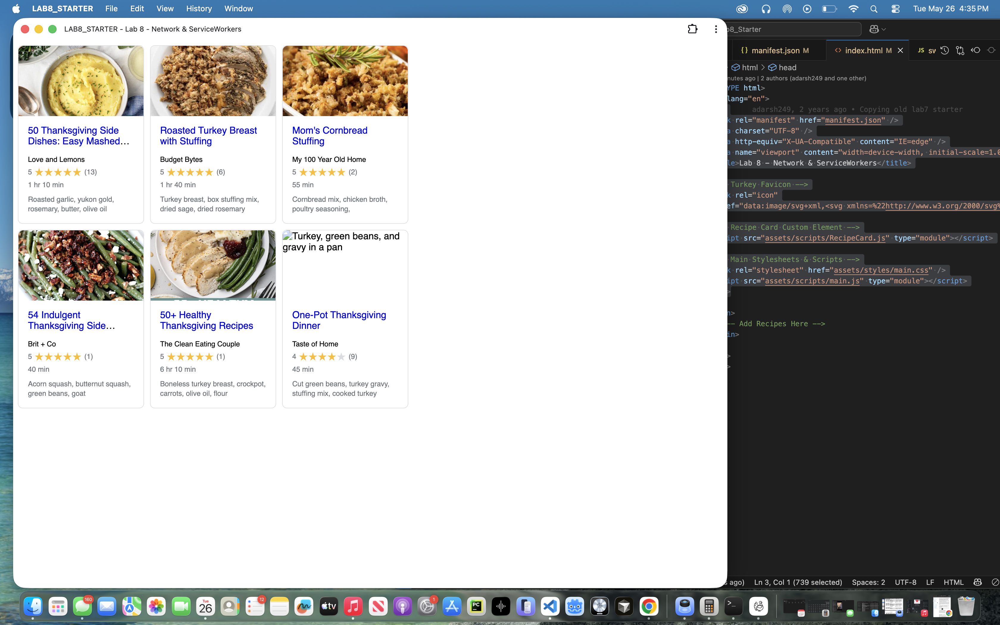

# Lab8-Starter
## Authors
- Michael Marras
## How are graceful degradation and service workers related?
Graceful degradation is a design principle where an application maintains core 
functionality even when some features fail. Service workers implement this by 
acting as a proxy between the app and network. For example, a service worker 
can intercept network requests and serve cached resources if the network is 
unavailable, allowing the app to remain functional offline instead of failing 
completely. 

